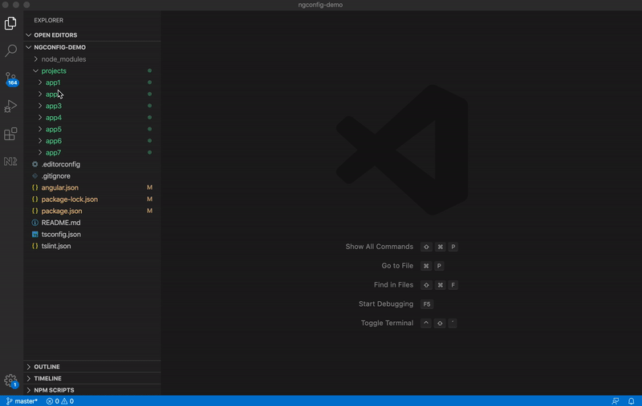

# NG Config


NGConfig is a visual code extension which helps dealing with large angular workspace projects which contain lots of apps and libraries.  
One of the issues with these types of projects is that the configuration for all these apps is held in one central json file (angular.json) and it can become difficult to edit the projects when the file becomes quite large.   
So this extension allows you to open partial parts of the angular.json in a separate editor. Those partial files are virtual and they allow you to focus on the project you are interested in.  
Just right click the coresponding project folder and select ```Open project config``` to select the project you are interested in.


